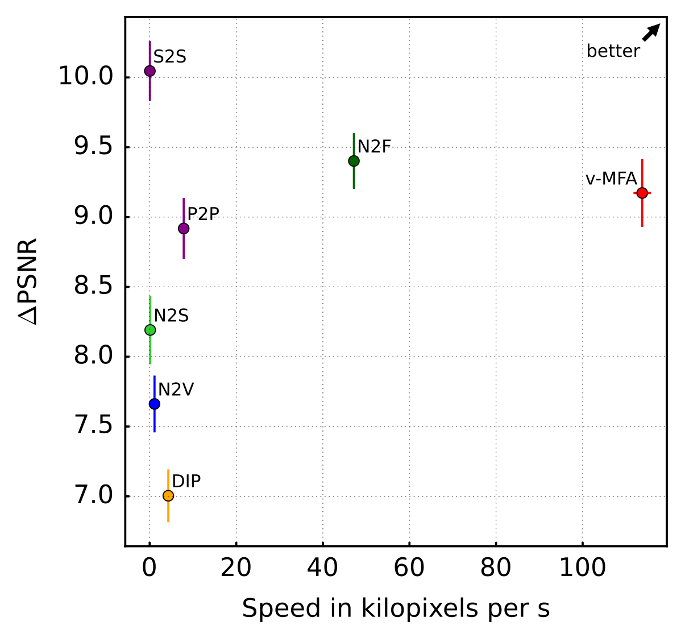
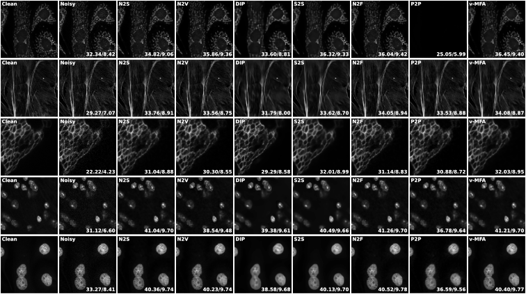
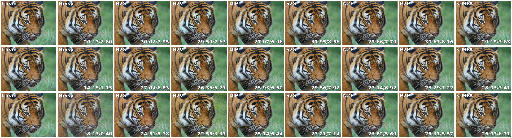

# VAMM-DX

**Variational Accelerated Mixture Models - Denoising eXtension (VAMM-DX)** is a Python/C++ package for fast denoising with mixture models, suitable for high-dimensional, large-scale datasets and large models.
Refer to the [related publications](#related-publications) for more details. To get started, check out the provided [example](#run-the-demo).

## Installation

### Requirements

Ensure the following requirements are met for installation:

- A C++ compiler that supports the C++17 Standard, such as the [GNU g++ Compiler](https://gcc.gnu.org/)
- [Python 3](https://www.python.org/) (version 3.9 or higher)
- [OpenMP](https://www.openmp.org/) (for parallel execution)
- [Git](https://git-scm.com/)

Please note that the code has only been tested on Linux distributions.

### Setup

1. **Clone the Repository**

    Clone this repository with the `--recursive` flag to include the required submodules:

    ```bash
    git clone --recursive git@github.com:variational-sublinear-clustering/vammdx.git
    cd vammdx/
    ```

    If you have cloned the repository without the `--recursive` flag, run the following commands inside the repository to initialize and update the submodules:

    ```bash
    git submodule update --init --recursive
    ```

    This will download further requirements: [VAMM](https://github.com/variational-sublinear-clustering/vamm.git), for variational mixture model optimization, and [ImageUtils](), for pre-/postprocessing and visualization, together with their dependencies.

2. **Install Python Packages**

    We recommend using [Anaconda](https://www.anaconda.com/) to manage the installation and create a new environment for the project:

    ```bash
    conda create -n vammdx python=3.9
    conda activate vammdx
    ```

    Next, install the package with [pip](https://pypi.org/project/pip/):

    ```bash
    pip install .
    ```

    This command builds the C++ libraries and installs the required Python dependencies, including the packages **VAMM** and **ImageUtils**. (Therefore, you can disregard the installation instructions in the respective README files for **VAMM** and **ImageUtils**.)

## Run the Demo

After [installation](#installation), you will be able to run **VAMM-DX**. Therefore, check out our [examples](./examples/README.md).
The demo denoises the 'House' image using Gaussian mixture models and reports the final PSNR and SSIM values.

## Results

In our [publication](#related-publications), we applied **VAMM-DX** to the task of *blind zero-shot denoising*.
We benchmarked our variational accelerated Mixture of Factor Analyzers (**v-MFA**) against several competing methods, including deep neural networks.
Our experiments demonstrate **state-of-the-art denoising runtimes** together with **highly competitive reconstruction quality**.

Below, we present an overview plot and qualitative examples across multiple datasets and noise levels. (*Note: the images shown here are downscaled.*) The bottom-right corner of each noisy and denoised image displays the corresponding PSNR and SSIM (×10) values.

For additional details, please refer to our [publication](#related-publications).



Denoising speed in kilopixels per second and PSNR gain of different blind zero-shot denoising algorithms (averaged over datasets and noise levels).


Visual comparison of different blind zero-shot denoising algorithms on images from the Set12 dataset at a noise level of 25.


Visual comparison of different denoising algorithms on images from the Set12 dataset at a noise level of 50.


Visual comparison of different denoising algorithms on images from the BSD68 dataset at a noise level of 25.


Visual comparison of different denoising algorithms on images from the BSD68 dataset at a noise level of 50.


Visual comparison of different denoising algorithms on confocal microscopy images (subsections of each image are shown).


Visual comparison of different denoising algorithms on a 'Tiger' image from the Div2K dataset at noise levels 25, 50 and 100 (from top to bottom).

## Related Publications

If you use this work, please cite the following paper:

S. Salwig*, T. Kahlke*, F. Hirschberger, D. Forster, and J. Lücke.
"Sublinear Variational Optimization of Gaussian Mixture Models with Millions to Billions of Parameters".
*[arXiv:2501.12299](https://arxiv.org/abs/2501.12299)* (2025).
*joint first authorship.

```bibtex
@article{SalwigKahlkeEtAl2025,
  title   = {Sublinear Variational Optimization of Gaussian Mixture Models with Millions to Billions of Parameters},
  author  = {Sebastian Salwig and Till Kahlke and Florian Hirschberger and Dennis Forster and J\"org L\"ucke},
  journal = {arXiv preprint arXiv:2501.12299},
  url     = {https://arxiv.org/abs/2501.12299}, 
  year    = {2025},
  note    = {Sebastian Salwig and Till Kahlke share first authorship on this work.}
}
```
